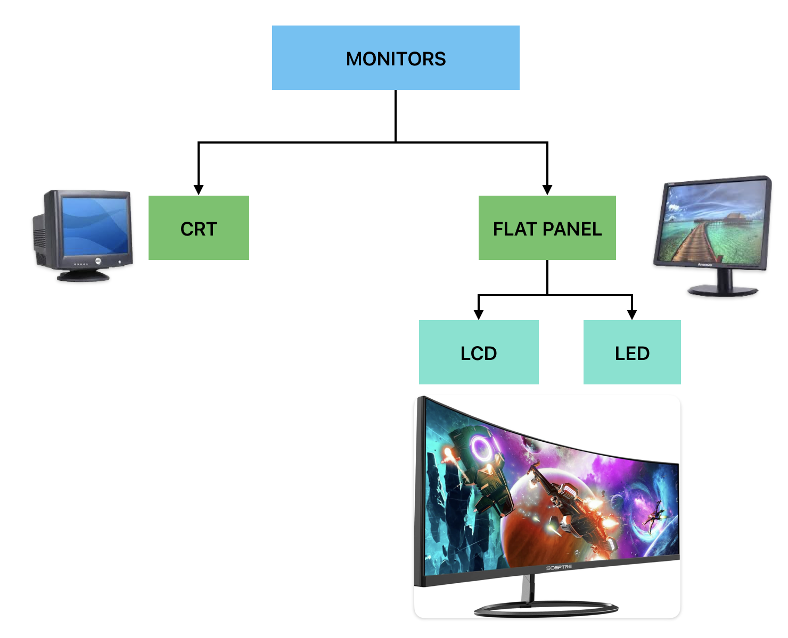
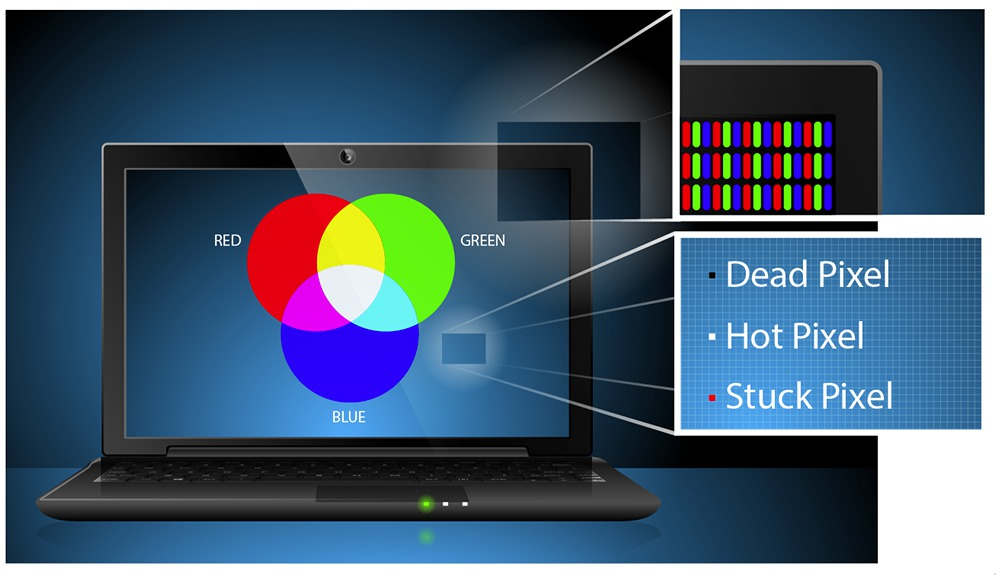

# 1.4 Basic Components of a Computer System

A computer system is made up of the following basic components:

- Hardware - Physical components of a computer system.
- Software - Programs (instructions to control hardware) that run on a computer system.
- Firmware - Software that is embedded in hardware.
- Live ware - People who operate and manage the computer system.

## Hardware

Hardware is the physical components of a computer system. Hardware components can be classified into five categories:

1. Input Devices
2. Output Devices
3. Processing Devices
4. Storage Devices
5. Communication Devices

Circuit boards are used to connect hardware components.

### 1. Input Devices

Input devices are used to enter data and instructions into a computer system. Examples of input devices include:

- Keyboard
- Mouse
- Trackball
- Joystick
- Touchpad
- Scanner - Scanner is an input device that captures images from the source which are then converted into a digital form that can be stored on the disk.
- Microphone
- Light Pen
- MICR
- OCR

### 2. Output Devices

Output devices are used to display the results of processing data. Examples of output devices include:

- Monitors (VDU - Visual Display Unit)
- Printers

#### Monitors

Forms images from tiny dots, called pixels that are arranged in a rectangular form. The resolution of the image depends upon the number of pixels.

For Further Understanding Watch this video:

<iframe width="560" height="315" src="https://www.youtube.com/embed/yxygknX1AiE?si=SAsmuuyD3EJXVV9i" title="YouTube video player" frameborder="0" allow="accelerometer; autoplay; clipboard-write; encrypted-media; gyroscope; picture-in-picture; web-share" referrerpolicy="strict-origin-when-cross-origin" allowfullscreen></iframe>

#### Printers

Printers are used to produce hard copies of data. There are two types of printers:

1. Impact Printers
2. Non-Impact Printers

##### Impact Printers

Impact printers use a mechanism to strike an inked ribbon, transferring characters to paper. Example: Dot Matrix Printers.

##### Non-Impact Printers

Non-impact printers do not use a striking mechanism. Example: Inkjet Printers, Laser Printers.
