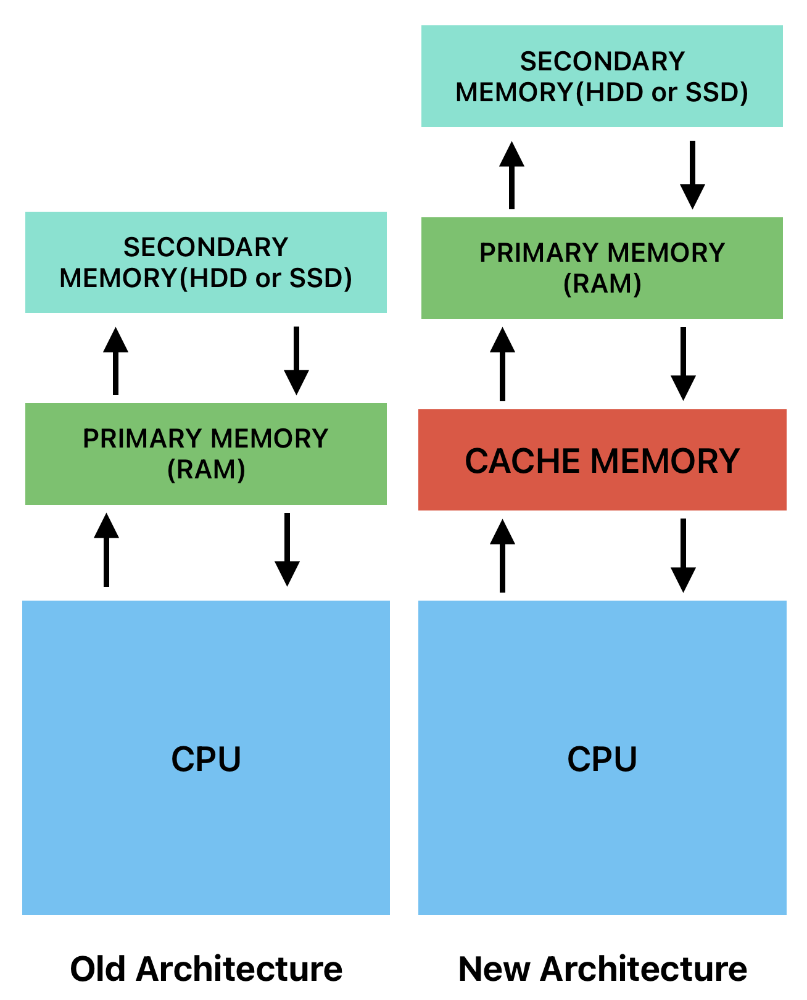

# 1.4 Basic Components of a Computer System

A computer system is made up of the following basic components:

- Hardware - Physical components of a computer system.
- Software - Programs (instructions to control hardware) that run on a computer system.
- Firmware - Software that is embedded in hardware.
- Live ware - People who operate and manage the computer system.

## Hardware

Hardware is the physical components of a computer system. Hardware components can be classified into five categories:

1. Input Devices
2. Output Devices
3. Processing Devices
4. Storage Devices
5. Communication Devices

Circuit boards are used to connect hardware components.

### 1. Input Devices

Input devices are used to enter data and instructions into a computer system. Examples of input devices include:

- Keyboard
- Mouse
- Trackball
- Joystick
- Touchpad
- Scanner - Scanner is an input device that captures images from the source which are then converted into a digital form that can be stored on the disk.
- Microphone
- Light Pen
- MICR
- OCR

### 2. Output Devices

Output devices are used to display the results of processing data. Examples of output devices include:

- Monitors (VDU - Visual Display Unit)
- Printers

#### Monitors

Forms images from tiny dots, called pixels that are arranged in a rectangular form. The resolution of the image depends upon the number of pixels.

For Further Understanding Watch this video:

<iframe width="560" height="315" src="https://www.youtube.com/embed/yxygknX1AiE?si=SAsmuuyD3EJXVV9i" title="YouTube video player" frameborder="0" allow="accelerometer; autoplay; clipboard-write; encrypted-media; gyroscope; picture-in-picture; web-share" referrerpolicy="strict-origin-when-cross-origin" allowfullscreen></iframe>

#### Printers

Printers are used to produce hard copies of data. There are two types of printers:

1. Impact Printers
2. Non-Impact Printers

##### Impact Printers

Impact printers use a mechanism to strike an inked ribbon, transferring characters to paper. Example: Dot Matrix Printers.

##### Non-Impact Printers

Non-impact printers do not use a striking mechanism. Example: Inkjet Printers, Laser Printers.

### 3. Memory Devices

Memory Devices.
A memory Is used to store date and instrictione. computer memory is the store Space in the computer system. where dos Is to processed and instructs required for pocessing are stored
Memory is Classified intos 5 types.

1. Primary memory
2. secondary memory
3. Cache memony

#### Primary Memory

Primary memory holds only those data and instructions on which the computer is currently working. It has a limited capacity and data is lost when power is switched off. It is generally made up of semiconductor device.

#### Secondary Memory

This type of memory is also known as external memory or non-volatile. It is slower than the main memory. These are used for storing data/information permanently. CPU does not access these memories directly instead they are accessed via input-output routines. The contents of secondary memories are first transferred to the main memory, and then the CPU can access it.

#### Cache Memory

Cache memory is a small-sized type of volatile computer memory that provides high-speed data storage and access to the processor. Cache memory is used to hold those parts of data and program which are most frequently used by the CPU. It is faster than main memory.

#### Memory Architecture

#### Comparison of Memory Devices

| Parameter  | Primary Memory     | Secondary Memory        | Cache Memory       |
| ---------- | ------------------ | ----------------------- | ------------------ |
| Volatility | Volatile           | Non-Volatile            | Volatile           |
| Speed      | Fast               | Slow                    | Fast               |
| Cost       | Expensive          | Cheaper                 | Expensive          |
| Capacity   | Less               | More                    | Less               |
| Location   | On the motherboard | Outside the motherboard | On the motherboard |

### 4. Processing Devices

Processing devices are used to process data. Mainly there are two types of processing devices identified as Central Processing Unit (CPU) and Graphics Processing Unit (GPU)

#### Central Processing Unit (CPU)

The Central Processing Unit (CPU) is the main processing device in a computer system. The CPU performs the following functions:

- Fetches instructions from memory.
- Decodes instructions.
- Executes instructions.
- Stores results.

#### Graphics Processing Unit (GPU)

A Graphics Processing Unit (GPU) is a specialized electronic circuit designed to accelerate the creation and rendering of images in a frame buffer intended for output to a display device. GPUs are used in embedded systems, mobile phones, personal computers, workstations, and game consoles.
